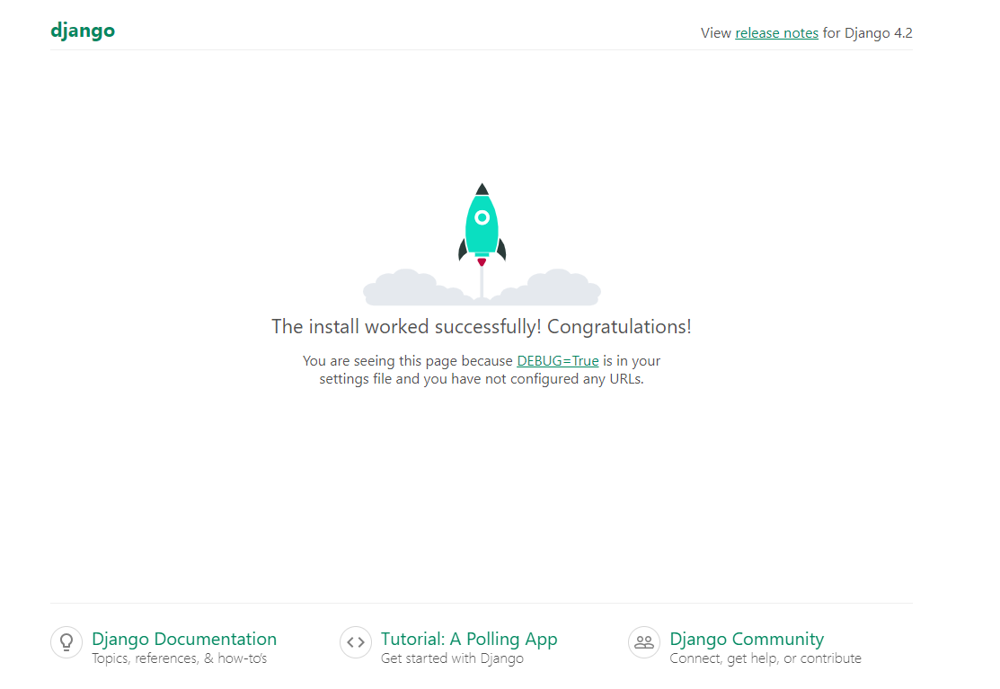

# DjangOps
<!-- markdownlint-disable MD013 -->
[](https://github.com/apexDev37/DjangOps/blob/main/README.md) [](https://docs.docker.com/reference/cli/docker/version/) [](https://www.python.org/downloads/) [](https://snyk.io/test/github/apexDev37/DjangOps) [](http://makeapullrequest.com) [](https://github.com/apexDev37/DjangOps/commits/main) [](https://github.com/pre-commit/pre-commit)
<!-- markdownlint-enable MD013 -->

> A simple devops-inspired template for Django applications setup with compose.

<!-- markdownlint-disable MD033 -->


<!-- markdownlint-disable MD033 -->

## Introduction

If you need a quick start with Django and Compose, you're in the right place.
DjangOps is a dev-ops-inspired template for perfectionists with deadlines,
who also happen to love Django and compose! Spin up a local dev environment
with modular custom settings in a few steps and focus on the value you want to
build. All comments, feedback, and contributions are highly encouraged.
I always love to hear and learn from the community❤

Learn more about the Django framework from the official [documentation].

## Installing / Getting started

This is an overview of the minimal setup needed to get started.

### Prerequisites

- [Git]
- [Docker]
- [Docker Compose]
- [Docker Desktop]
- IDE/Code/Text editor ([PyCharm], [VScode], [Vim], etc)

Follow these tutorials to set up Docker and Compose on either [Mac]
or [Linux].  
I'd recommend Microsoft's documentation to set up [Docker on WSL2] if you're on Windows.

### Local Setup

> The following setup was run on Ubuntu focal (20.04.6 LTS)

You can clone this repo with the following command.

- Clone repository

```bash
    # cd your/desired/target/dir
    $ git clone git@github.com:apexDev37/DjangOps.git my-project
    $ cd my-project
```

> This will clone the repository to a target dir on your host machine with
 a custom name `my-project/` and navigate into its root dir.

### Configuration

Before running your application with Compose, configure your
environment variables in the `./.envs/` directory. Example `env` files are provided
to configure the following instances: Django and Postgres.
You can create the required `env` files with the following code snippet.

- Create env files

```bash
    # ensure you're in the project's root
    $ for file in .envs/*.example; do cp "$file" "${file%.example}"; done
    $ cd .envs/
```

> This will loop through all the files in the .envs/ directory that end with
.example and creates new files without the `.example` extension
(ie. `django.env.example` -> `django.env`).  
> ⚠ After the `env` files are created, replace the placeholders with your own
config values for your Django and Postgres instances.

### Launch

You're all set to run your Django application.
Spin up your Django and Postgres instances with the following command.

- Spin up containers

```bash
    # ensure you're in the project's root
    $ docker compose down
    $ docker compose up -d
```

> This will create and start the Django and Postgres instances in the same
network defined in the `compose` file.

Once the containers have been created and started, you can access the
application at <http://localhost:8000>


## Licensing

To make a repository open source, you must license it so that others may freely
use, modify, and distribute the software. Using the [MIT license], this project
ensures this. The full original text version of the license may be seen [here].
To apply the right to your repository, follow the procedures.

[//]: # "These are reference links used in the body of this note and get stripped out when the markdown processor does
its job. There is no need to format nicely because it shouldn't be seen.
Thanks SO - http://stackoverflow.com/questions/4823468/store-comments-in-markdown-syntax"

<!-- Introduction links -->

[documentation]: https://docs.djangoproject.com/en/

<!-- Installing / Getting Started links -->

[Git]: https://git-scm.com/
[Docker]: https://www.docker.com/
[Docker Compose]: https://docs.docker.com/compose/
[Docker Desktop]: https://www.docker.com/products/docker-desktop/
[Mac]: https://docs.docker.com/desktop/install/mac-install/
[Linux]: https://docs.docker.com/desktop/install/linux-install/
[Docker on WSL2]: https://learn.microsoft.com/en-us/windows/wsl/tutorials/wsl-containers/
[PyCharm]: https://www.jetbrains.com/pycharm/
[VScode]: https://code.visualstudio.com/
[Vim]: https://www.vim.org/

<!-- Licensing links -->

[MIT license]: https://en.wikipedia.org/wiki/MIT_License
[here]: https://choosealicense.com/licenses/mit/
